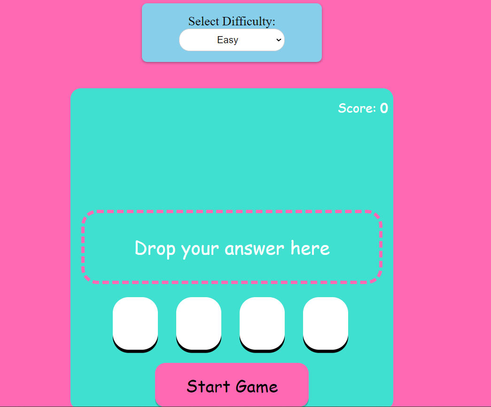
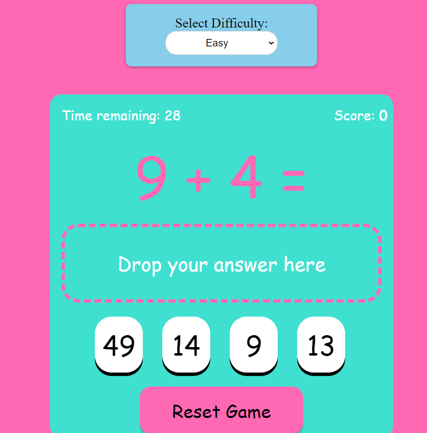

Title: Just Math It

Screenshot of main page: 

Background Information: The inspiration behind this game was to instill the interest of maths and basic computer skills in young children by incorporating simple maths equations with the handling of keypad/mouse. The game is basically to test the user's ability to answer basic maths problem equations within a defined time. Problem equations include the usage of basic mathematical operators such as addition, subtraction, multiplication and division. However, instead of clicking the answer, user will have to drag the answer and drop it into an assigned drop area. The purpose of incorporating the drag and drop function is to enable the user to have a hands-on practice in handling a mouse or a keypad. The game was also designed to feature 3 diffiulty levels, to ensure that user is able to play the game based on his or her own strengths.

The files of the game can be found by accessing the following github url : https://github.com/FairuzFairuz/Just_Math_It.git

Thought process and Planning Phase:

1. Have a definitive outline of the general flow of the game for example difficulty level, layout, user input.
2. Created a wireframe diagram on user interface of the game
3. Created “containers” for different segments of the game
4. Created the functions to generate questions using the 4 mathematical operators
5. Created the function to define the difficulty level
6. Created the function to link the difficulty level to generate the problem equations
7. Created the function to drag and drop the answer instead of just clicking
8. Finalize appearance of game by adjusting borders, font and background colors

Screenshot of working game: 

Credits and Attribution:

- Drag and drop:

1. https://interactjs.io/
2. https://www.w3schools.com/html/html5_draganddrop.asp
3. https://developer.mozilla.org/en-US/docs/Web/API/HTML_Drag_and_Drop_API
4. https://dev.to/lensco825/making-a-simple-drag-and-drop-with-js-29l2

- Countdown timer:

1. https://www.w3schools.com/howto/howto_js_countdown.asp
2. https://how.dev/answers/how-to-create-a-countdown-timer-using-javascript

Technologies Used:

1. Javascript
2. HTML
3. CSS

Future Improvements:

1. Input animations and audio when answering questions to further improve the visual experience of the user
2. To design levels to advance within each difficulty category
